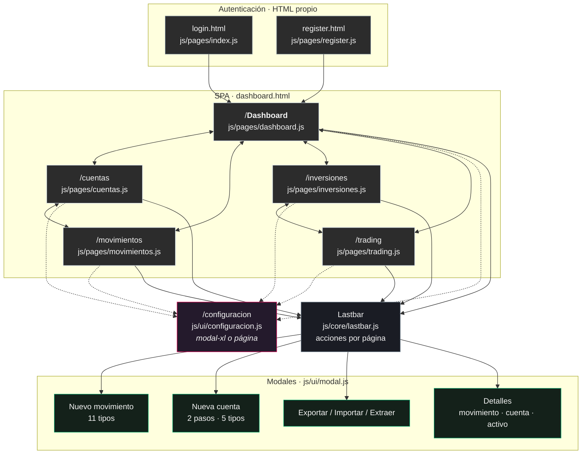

# Diseño de interfaz de escinco

Extraído del código fuente. Todas las citas son `archivo:línea` verificables.

**Proyecto**: escinco · SPA de finanzas personales · Hosting + Firebase

---

## Sección 1 — Colores

### 1.1 Arquitectura del sistema de color

escinco usa un **sistema de dos niveles**:

1. **Primitivas**: 18 coloresbase con nombre, declarados una sola vez en
   `:root` (`css/style.css:69-91`). No dependen del tema.
2. **Semánticas**: 21 variables que apuntan a las primitivas, re-declaradas
   íntegras para cada tema en `[data-theme="dark"]` (`css/style.css:100-133`) y
   `[data-theme="light"]` (`css/style.css:136-167`).

El tema se aplica con el atributo `data-theme` sobre `<html>`, escrito por
`js/core/tema.js:52`. El valor por defecto está en el HTML: los cuatro
documentos abren con `data-theme="dark"` (`dashboard.html:2`, `login.html:2`,
`register.html:2`, `404.html:2`), y se persiste en `localStorage`
(`js/core/tema.js:67,79`). El `theme-color` del navegador se sincroniza con el
fondo real de cada tema: `#141414` en oscuro, `#cfcfcf` en claro
(`js/core/tema.js:56`).

Esta separación es la que permite tematizar sin duplicar reglas: ningún archivo
CSS fuera de `style.css` declara un color literal para superficies; todos usan
`var(--*)`.

### 1.2 Paleta primitiva

`css/style.css:69-91`. Los nombres siguen una nomenclatura de color
descriptiva en inglés (*onyx*, *slate grey*, *cotton candy*, *pale sky*,
*white smoke*, *raspberry red*, *tropical mint*, *mustard*, *banana*), no
funcional.

| Primitiva | Valor | Alpha |
|---|---|---|
| `--onyx` | `#141414` | opaco |
| `--lightOnyx` | `#141414AE` | 68% |
| `--graphite` | `#2C2C2C` | opaco |
| `--lightGraphite` | `#2C2C2C36` | 21% |
| `--slateGrey` | `#738391` | opaco |
| `--lightSlateGrey` | `#7383915f` | 37% |
| `--paleSky` | `#D0DCE8` | opaco |
| `--lightPaleSky` | `#d0dce85f` | 37% |
| `--whiteSmoke` | `#F3F3F3` | opaco |
| `--lightWhiteSmoke` | `#F3F3F336` | 21% |
| `--smoke` | `#cfcfcf` | opaco | 
| `--cottonCandy` | `#FFA4A4` | opaco |
| `--lightGreen` | `#BFFFC5` | opaco |
| `--banana` | `#ffd181` | opaco |
| `--raspberryRed` | `#DC0051` | opaco |
| `--tropicalMint` | `#00a269` | opaco |
| `--mustard` | `#f5a623` | opaco |

**Hallazgo**: `--smoke` (`#cfcfcf`) está declarada en `css/style.css:86` pero
**no se usa en ninguna regla**: 0 apariciones de `var(--smoke)`. Es una
primitiva huérfana. Detalle menor, no funcional.

### 1.3 Variables semánticas: valor por tema

Los valores de la columna "dark" y "light" son **el resultado de resolver la
referencia** a la primitiva, no el texto literal del CSS. Ejemplo:
`--positive: var(--lightGreen)` en oscuro se traduce a `#BFFFC5`.

#### Fondos

| Variable | Dark | Light | Uso |
|---|---|---|---|
| `--background` | `#141414` | `#F3F3F3` | Fondo de la página. 32 usos. |
| `--backgroundAlt` | `#D0DCE8` | `#2C2C2C` | Fondo alterno para zonas invertidas. 4 usos. |
| `--surface` | `#2C2C2C` | `#D0DCE8` | Fondo de cards, botones y paneles. 55 usos, es la superficie dominante. |
| `--glass-frosted` | `#14141499` | `#F3F3F399` | Velo translúcido de superficies "congeladas". 2 usos. |

#### Textos

| Variable | Dark | Light | Uso |
|---|---|---|---|
| `--text` | `#F3F3F3` | `#141414` | Texto principal. 147 usos: la variable más usada. |
| `--textSecondary` | `#D0DCE8` | `#738391` | Etiquetas, rótulos y texto atenuado. 110 usos. |
| `--textAct` | `#F3F3F3` | `#2C2C2C` | Texto de elemento en estado activo. Solo 2 usos. |
| `--textAlt` | `#2C2C2C` | `#F3F3F3` | Texto sobre superficies de color. 22 usos. |

#### Bordes

| Variable | Dark | Light | Uso |
|---|---|---|---|
| `--border` | `#D0DCE8` | `#738391` | Borde principal de cards, modales y campos. 133 usos. |
| `--borderAlt` | `#738391` | `#2C2C2C` | Borde secundario, separadores internos. 6 usos. |
| `--lightBorder` | `#F3F3F336` | `#2C2C2C36` | Borde tenue en hover y superficies frías. 3 usos. |

#### Estados

| Variable | Dark | Light | Uso |
|---|---|---|---|
| `--positive` | `#BFFFC5` | `#00a269` | Texto y borde de montos inflows. 43 usos. |
| `--positiveAlt` | `#00a269` | `#BFFFC5` | Relleno sólido de lo positivo. 6 usos. |
| `--negative` | `#FFA4A4` | `#DC0051` | Texto y borde de montos que salen. 77 usos. |
| `--negativeAlt` | `#DC0051` | `#FFA4A4` | Relleno sólido de lo negativo. 10 usos. |
| `--ambar` | `#ffd181` | `#f5a623` | Estado de advertencia: umbral de crédito. 15 usos. |
| `--ambarAlt` | `#f5a623` | `#ffd181` | Relleno sólido de advertencia. **1 solo uso.** |

> Nota: el proyecto llama a este estado `--ambar` / `--ambarAlt`, no
> `--warning`. Es el nombre que hay que documentar.

#### Otros

| Variable | Dark | Light | Uso |
|---|---|---|---|
| `--shadow` | `#d0dce85f` | `#7383915f` | Sombras y glows. 39 usos. |
| `--lightHover` | `#7383915f` | `#d0dce85f` | Fondo de estado hover. 47 usos. |
| `--blurBackground` | `#141414AE` | `#d0dce85f` | Fondo difuminado del overlay de modal. 1 uso. |
| `--skeleton-base` | `color-mix(surface 78%, border)` | idem | Base de los esqueletos de carga. |
| `--skeleton-highlight` | `color-mix(text 14%, transparent)` | idem | Brillo de los esqueletos de carga. |

Los dos últimos (`css/style.css:95-96`) usan `color-mix()` en vez de un color
fijo, así que se adaptan solos al cambio de tema.

### 1.4 Dónde se usa cada color

Cuatro ejemplos por variable, con cita real.

**`--background`** (fondo de página)
- `css/style.css:182` — `body { background-color: var(--background) }`
- `css/style.css:293` — `button { background-color: var(--background) }`
- `css/dashboard.css:80` — fondo de la card de patrimonio

**`--surface`** (fondo de cards y botones)
- `css/style.css:251` — superficie base de la familia `.glass`
- `css/style.css:515` — card de 25px de radio
- `css/cuentas.css:115` — `.cuenta-perfil-icono`
- `css/pendientes.css:264` — `.tipo-movimiento-btn` secundarios

**`--text`** (texto principal)
- `css/style.css:188` — color base de `html, body`
- `css/cuentas.css:132` — `.cuenta-perfil-titulo h3`
- `css/modal.css:31` — `.modal`
- `css/dashboard.css:913` — texto de la card activa

**`--textSecondary`** (rótulos)
- `css/style.css:309` — texto atenuado genérico
- `css/cuentas.css:240` — `.cuenta-detalle .field .label`
- `css/configuracion.css:494` — `.footer-copy`
- `css/modal.css:210` — `.modal-footer`

**`--textAct`** (activo) — solo 2 usos
- `css/dashboard.css:913` — texto de la card activa del dashboard
- `css/navegacion.css:62` — texto del ítem de navegación activo

**`--textAlt`** (sobre superficie de color)
- `css/cuentas.css:116` — icono de perfil de cuenta
- `css/dashboard.css:389` — subtítulo de card
- `css/dashboard.css:690` — rótulo dentro de barra de progreso

**`--border`** (bordes)
- `css/modal.css:38` — borde del `.modal`
- `css/modal.css:89` — separador bajo el header
- `css/modal.css:137` — borde de `.modal-close`
- `css/style.css:514` — borde de card

**`--borderAlt`** (borde secundario)
- `css/dashboard.css:398` — separador de lista de movimientos
- `css/inversiones.css:468` — borde de tarjeta de estrategia
- `css/movimientos.css:440` — borde de fila de tabla

**`--positive`** / **`--negative`**
- `css/cuentas.css:159` — `.cuenta-badge.estado` positivo, texto
- `css/cuentas.css:169` — el mismo badge en estado crítico
- `css/cuentas.css:187` — saldo grande positivo
- `css/cuentas.css:191` — saldo grande negativo

**`--positiveAlt`** / **`--negativeAlt`** (relleno)
- `css/dashboard.css:849` — fondo de barra positiva
- `css/dashboard.css:863` — fondo de barra negativa
- `css/componentes.css:391` — texto sobre relleno positivo

**`--ambar`**
- `css/cuentas.css:164` — `.cuenta-badge.estado.aviso`
- `css/dashboard.css:867` — barra de uso en advertencia
- `css/dashboard.css:898` — texto de advertencia

**`--shadow`**
- `css/style.css:305` — `box-shadow` de `.form-input:hover`
- `css/style.css:1021` — `--glow` de las superficies grandes
- `css/modal.css:45` — `--glow: 0 0 20px var(--shadow)` del modal
- `css/modal.css:164` — sombra de `.modal-header` en hover

**`--lightHover`**
- `css/style.css:303` — `.form-input:hover`
- `css/style.css:334` — `select:hover`
- `css/navegacion.css:72` — ítem de navegación en hover
- `css/configuracion.css:58` — `.config-nav button:hover`

**`--blurBackground`** (1 uso)
- `css/modal.css:9` — overlay del modal estándar

**`--glass-frosted`** (2 usos)
- `css/componentes.css:73` — tooltip del lastbar
- `css/navegacion.css:461` — notificaciones

### 1.5 Un rasgo del sistema que conviene documentar

En tema oscuro `--border` resuelve a `#D0DCE8`, un color **claro**, sobre un
fondo `#141414` **oscuro**: el contraste borde-fondo es alto y los 133 bordes
del sistema se ven. En tema claro `--border` es `#738391`, un tono medio sobre
`#F3F3F3`.

Esto es coherente con la intención declarada en el propio CSS. `css/modal.css:39-42`
describe la superficie como *"congelada: sin fondo propio, el difuminado del
overlay es lo que da cuerpo a la ventana"*, y `css/style.css:127-131` explica que
las superficies translúcidas necesitan *"un velo para que el texto se lea y el
difuminado se vea"*. Es decir: **la legibilidad en escinco no depende solo del
contraste texto-fondo, sino del contraste texto-borde**. El borde es un elemento
de contraste deliberado, no un separador tenue.

**Interpretación, no documentada en el código**: la decisión de que el borde sea
claro en oscuro y medio en claro sugiere que el diseño se generó para funcionar
sobre el modo oscuro por defecto (el HTML abre en `dark`), priorizando el volumen
de las superficies sobre la sutileza del separador.

### 1.6 Psicología del color

**Aviso**: el código **no contiene ninguna justificación** del por qué de cada
color. Solo hay comentarios sobre el velo de legibilidad (`css/style.css:127-131`,
`css/modal.css:39-42`) y el casing en minúsculas de las primitivas. Todo lo que
siga es **interpretación**, no documentación del equipo.

| Color | Interpretación |
|---|---|
| Verde (`#00a269` tropicalMint, `#BFFFC5` lightGreen) | AsociaciónUniversal con ingresos y saldo positivo. El matiz frío de `lightGreen` y el turquesa de `tropicalMint` evitan el verde "neón" y mantienen legibilidad sobre fondo oscuro. |
| Rojo/rosa (`#DC0051` raspberryRed, `#FFA4A4` cottonCandy) | Asociación universal con salidas y deuda. El `#DC0051` es un magenta-rosa más que un rojo puro: evita la alarma visual dura y, en tema claro sobre blanco, mantiene contraste. |
| Ámbar (`#f5a623` mustard, `#ffd181` banana) | Semáforo: estado intermedia de advertencia. Es el tercer estado real del proyecto (umbral de uso de tarjetas de crédito), y ocupa una posición intermedia entre positivo y negativo. |
| Gris azulado (`#738391` slateGrey) | Texto secundario y bordes. La componente azul lo hace menos "sucio" que un gris puro y lo aleja de los neutros de los tres estados. |
| Azul hielo (`#D0DCE8` paleSky) | Fondo de superficie en oscuro y texto principal secundario. Aporta la única variación de temperatura del sistema: los neutros son fríos y los tres estados son cálidos, lo que separa por sí solo "superficie" de "semántica". |
| Negro casi puro (`#141414` onyx) | Fondo en oscuro. No es `#000`, lo que reduce el contraste con el texto blanco y hace menos agresivo el modo oscuro. |
| Blanco humo (`#F3F3F3` whiteSmoke) | Fondo en claro. Igual que el anterior, no es `#fff`: suaviza el modo claro. |

**Patrón que sí es observable en el código**: los cuatro colores de estado
(`--positive`, `--negative`, `--ambar` y sus `Alt`) **invierten su valor entre
temas**. `tropicalMint` es el relleno positivo en claro pero el texto positivo en
oscuro. El motivo es de contraste: un verde saturado sobre fondo oscuro
necesita ser el relleno y no el texto, y un verde pastel sobre fondo claro
necesita lo contrario. El sistema lo resuelve con el par `X` / `XAlt`.

---
---

## Sección 2 — Tipografía

### 2.1 Las dos familias

escinco usa **dos familias tipográficas**, declaradas como variables en
`css/style.css:93-94`:

| Variable | Familia | Pila de respaldo | Archivo |
|---|---|---|---|
| `--font-primary` | **Inter** | `Arial, sans-serif` | `css/style.css:93` |
| `--font-secondary` | **Roboto Mono** | `"Courier New", monospace` | `css/style.css:94` |

Ambas se **autoalojan**: 10 archivos `.ttf` en `fonts/`, servidos desde el
propio Hosting, sin CDN ni petición a terceros.

| Familia | Variantes | Archivos |
|---|---|---|
| Inter | Regular (400), Italic (400), Medium (500), SemiBold (600), Bold (700) | 5 `.ttf`, 343-347 KB cada uno |
| Roboto Mono | Regular (400), Italic (400), Medium (500), SemiBold (600), Bold (700) | 5 `.ttf`, 87-95 KB cada uno |

Los 5 cortes de cada familia están declarados: no hay ninguna combinación de
peso que dependa de *sintética* del navegador. Inter pesa el doble que Roboto
Mono porque incluye más glifos por archivo.

### 2.2 Declaraciones `@font-face`

`css/style.css:1-62`, 10 bloques. Orden: primero Roboto Mono, luego Inter.

| Líneas | Familia | `font-weight` | `font-style` | Archivo |
|---|---|---|---|---|
| `2-7` | Roboto Mono | 400 | italic | `RobotoMono-Italic.ttf` |
| `8-13` | Roboto Mono | 400 | normal | `RobotoMono-Regular.ttf` |
| `14-19` | Roboto Mono | 500 | normal | `RobotoMono-Medium.ttf` |
| `20-25` | Roboto Mono | 600 | normal | `RobotoMono-SemiBold.ttf` |
| `26-31` | Roboto Mono | 700 | normal | `RobotoMono-Bold.ttf` |
| `34-39` | Inter | 400 | italic | `Inter_18pt-Italic.ttf` |
| `40-45` | Inter | 400 | normal | `Inter_18pt-Regular.ttf` |
| `46-51` | Inter | 500 | normal | `Inter_18pt-Medium.ttf` |
| `52-57` | Inter | 600 | normal | `Inter_18pt-SemiBold.ttf` |
| `58-63` | Inter | 700 | normal | `Inter_18pt-Bold.ttf` |

Todas en formato `truetype` (`format("truetype")`). **No hay `font-display`**, así
que la fuente se carga con el comportamiento por defecto del navegador. Tampoco
hay `unicode-range` ni subconjuntos: cada archivo es completo.

### 2.3 Escala tipográfica

**Hallazgo importante**: `body` **no declara `font-size`**. Ni `html`, ni `body`,
ni un selector universal lo hacen en ninguna parte del CSS. El tamaño base es
por tanto **16px**, el default del navegador (`css/style.css:173-189` define
`font-family`, color y layout en `body`, pero ningún tamaño).

De ahí que el CSS use valores absolutos en `px` en lugar de `rem`: el sistema no
tiene una raíz tipográfica propia, parte del 16px del navegador.

| Tamaño | Ocurrencias | Rol | Citas representativas |
|---|---|---|---|
| **10px** | 6 | Etiqueta mínima, eje de gráfico | `css/dashboard.css:891`, `css/dashboard.css:942` |
| **11px** | 19 | Badge, rótulo en mayúsculas | `css/cuentas.css:139` (`.cuenta-badge`), `css/cuentas.css:623` |
| **12px** | **45** | Detalle: hints, pie, copyright, tooltips de card | `css/componentes.css:423` (`.hint`), `css/configuracion.css:224`, `css/navegacion.css:766` |
| **13px** | **41** | Texto secundario en interfaz densa | `css/componentes.css:114` (`.notificacion-mensaje`), `css/configuracion.css:255` |
| **14px** | 21 | **Cuerpo de la interfaz**: botones, campos, items de navegación | `css/style.css:297` (`.form-input`), `css/navegacion.css:171` (`#sidebar button`), `css/configuracion.css:50` |
| **15px** | 6 | Tooltip de lastbar | `css/navegacion.css:464` |
| **16px** | 2 | Título de mensaje de peligro en modal | `css/modal.css:508`, `css/configuracion.css:360` |
| **18px** | 1 | Icono grande de mensaje de modal | `css/modal.css:140` |
| **20px** | 4 | Título de modal y título de perfil | `css/modal.css:108` (`.modal-title`), `css/cuentas.css:131` (`h3`) |
| **22px** | 2 | Título de panel de detalle | `css/navegacion.css:729`, `css/cuentas.css:44` |
| **24px** | 3 | Valor de resumen en Inversiones | `css/inversiones.css:31` |
| **26px** | 1 | Valor de card en móvil | `css/dashboard.css:497` |
| **28px** | 3 | Título de panel principal | `css/componentes.css:211` (`.panel-header h2`), `css/navegacion.css:350` (`#panel h2`) |
| **32px** | 3 | Valor de card de dashboard | `css/dashboard.css:196`, `css/trading.css:40` |
| **36px** | 3 | Cifra de patrimonio y saldo grande | `css/dashboard.css:270`, `css/cuentas.css:179` |
| **40px** | 1 | Icono de gráfico vacío | `css/dashboard.css:547` |
| **48px** | 1 | Icono de mensaje de modal | `css/modal.css:495` |
| **64px** | 1 | Cifra de la página 404 | `css/404.css:37` |

**Tres valores fluidos con `clamp()`**, que son los que hacen responsiva la
jerarquía numérica:

| Valor | Selector | Cita |
|---|---|---|
| `clamp(24px, 2.4vw, 32px)` | Patrimonio | `css/dashboard.css:240` |
| `clamp(22px, 2vw, 28px)` | Valor de card de métrica | `css/dashboard.css:805` |
| `clamp(22px, 2vw, 28px)` | Valor de card de activo | `css/dashboard.css:1457` |

El patrimonio usa además `letter-spacing: -0.05em` (`css/dashboard.css:241`),
un ajuste óptico de tracking que sólo tiene sentido en cifras muy grandes.

### 2.4 Pesos y estilos

El sistema usa **cuatro pesos**: 400 (regular), 500 (medium), 600 (semibold) y
700 (bold). Los tres últimos son declarados explícitamente; el 400 es el default
y solo se nombra en los `@font-face`.

| Peso | Ocurrencias | Contexto |
|---|---|---|
| 400 | 4 (solo `@font-face`) | Texto corrido, sin emphasis |
| 500 | 31 | Rótulos, botones secundarios, celdas de tabla |
| 600 | **42** | **Peso de títulos y cifras.** El más usado junto al 500 |
| 700 | 5 | Solo cifras grandes y el número de la página 404 |

Reparto notable:
- `css/dashboard.css:197` — valor de card, peso 700
- `css/cuentas.css:180` — saldo grande, peso **600** (no 700)
- `css/cuentas.css:352` — valor de resumen de crédito, 500
- `css/trading.css:41` — precio actual, 600
- `css/inversiones.css:32` — valor de resumen, 600
- `css/modal.css:109` — título de modal, 600
- `css/componentes.css:213` — `h2` de panel, 600
- `css/404.css:38` — cifra de la 404, 700

### 2.5 Interlineados

Ocho declaraciones en todo el proyecto. No hay un interlineado global: cada
componente declara el suyo.

| Valor | Selectores | Cita |
|---|---|---|
| `1` | Número de la 404 | `css/404.css:39` |
| `1.1` | Saldo grande de cuenta | `css/cuentas.css:183` |
| `1.2` | Valor de card de dashboard | `css/dashboard.css:199` |
| `1.3` | Valor de card comprimida | `css/dashboard.css:1629` |
| `1.4` | Mensaje de notificación | `css/componentes.css:115` |
| `1.5` | Texto de modal | `css/modal.css:307` |
| `1.6` | Item de trading | `css/trading.css:283` |
| `1.8` | Texto largo de modal | `css/modal.css:534` |

**Patrón consistente**: las cifras grandes usan interlineado **cerrado**
(1.1-1.3) y el texto corrido usa **abierto** (1.4-1.8). Esto evita que un número
de 36px con interlineado 1.5 ocupe más altura del que le corresponde y desalinee
el bloque que lo contiene.

### 2.6 Dónde se usa cada familia

**Inter (`--font-primary`)** — todo el texto. Está declarada en `html, body`
(`css/style.css:174`), así que es la familia por defecto de toda la aplicación y
**solo hay que re-declararla en los componentes con su propio `font-family`**:
`.form-input` (`css/style.css:296`), `#sidebar button` (`css/navegacion.css:170`),
`.modal-btn` (`css/modal.css:219`).

**Roboto Mono (`--font-secondary`)** — **exclusivamente cifras**, nunca texto de
lectura. 43 declaraciones repartidas así:

| Archivo | Usos | Qué cifras |
|---|---|---|
| `css/dashboard.css` | 14 | Valores de cards, patrimonio, gráficos |
| `css/inversiones.css` | 7 | Valores de resumen, precios de activo |
| `css/cuentas.css` | 4 | Saldo grande, saldo de cuenta |
| `css/trading.css` | 4 | Precio actual, P&L |
| `css/componentes.css` | 3 | Cifras de card |
| `css/style.css` | 3 | Definición de la variable |
| `css/configuracion.css` | 3 | Cifras de preferencias |
| `css/modal.css`, `css/movimientos.css`, `css/navegacion.css`, `css/index.css`, `css/404.css` | 1 cada uno | Casos puntuales |

Los tres ejemplos más representativos:
- `css/dashboard.css:195` — valor de card: `font-family: var(--font-secondary)` con `32px` y peso 700
- `css/cuentas.css:178` — saldo grande de cuenta: `36px`, peso 600
- `css/dashboard.css:269` — total del modal de patrimonio: `36px`, peso 700

**Y también en el canvas**: los gráficos de Chart.js fuerzan Roboto Mono en sus
ejes, con `font: { size: 10, family: 'Roboto Mono' }` en
`js/ui/graficos.js:151,161,316,332`. Es el mismo criterio que en CSS: las
cifras del eje son cifras.

### 2.7 Tabla de escala por elemento

| Elemento | Familia | Tamaño | Peso | Interlineado | Uso |
|---|---|---|---|---|---|
| Cifra de la 404 | Roboto Mono | `64px` | 700 | `1` | `css/404.css:37-39` |
| Icono de mensaje de modal | Inter | `48px` | 400 | — | `css/modal.css:495` |
| Icono de gráfico vacío | Inter | `40px` | 400 | — | `css/dashboard.css:547` |
| Saldo grande de cuenta | Roboto Mono | `36px` | 600 | `1.1` | `css/cuentas.css:177-183` |
| Total de patrimonio (modal) | Roboto Mono | `36px` | 700 | — | `css/dashboard.css:266-273` |
| Valor de card de dashboard | Roboto Mono | `32px` | 700 | `1.2` | `css/dashboard.css:194-199` |
| Precio actual (trading) | Roboto Mono | `32px` | 600 | — | `css/trading.css:38-42` |
| Valor de card comprimida | Roboto Mono | `15px` | 700 | `1.3` | `css/dashboard.css:1627-1630` |
| **Patrimonio (dashboard)** | **Roboto Mono** | **`clamp(24px, 2.4vw, 32px)`** | **700** | `1.2` | `css/dashboard.css:236-241` |
| Valor de card de métrica | Roboto Mono | `clamp(22px, 2vw, 28px)` | 700 | — | `css/dashboard.css:805` |
| `h2` de panel principal | Inter | `28px` | 600 | — | `css/componentes.css:209-213` |
| `h2` de panel (responsive) | Inter | `22px` | 600 | — | `css/navegacion.css:728-730` |
| Valor de resumen (inversiones) | Roboto Mono | `24px` | 600 | — | `css/inversiones.css:29-33` |
| Valor de resumen de crédito | Inter | `20px` | 400 (heredado) | — | `css/cuentas.css:349-351` |
| Título de modal | Inter | `20px` | 600 | — | `css/modal.css:107-112` |
| `h3` de perfil de cuenta | Inter | `20px` | 600 | — | `css/cuentas.css:129-132` |
| Icono grande de mensaje | Inter | `18px` | 400 | — | `css/modal.css:140` |
| Tooltip de lastbar | Inter | `15px` | 400 | — | `css/navegacion.css:464` |
| **Cuerpo / campos / botones** | **Inter** | **`14px`** | **400-500** | — | `css/style.css:297`, `css/navegacion.css:171`, `css/modal.css:220` |
| Título de mensaje de peligro | Inter | `16px` | 600 | — | `css/modal.css:505-508` |
| Texto de interfaz densa | Inter | `13px` | 500 | `1.4` | `css/componentes.css:114-115` |
| **Detalle / hints / rótulos** | **Inter** | **`12px`** | **400-500** | — | `css/componentes.css:423` |
| Badge / rótulo en versales | Inter | `11px` | 600 | — | `css/cuentas.css:138-147` |
| Etiqueta mínima | Inter | `10px` | 400 | — | `css/dashboard.css:891` |
| Eje de gráfico (canvas) | Roboto Mono | `10px` | 400 | — | `js/ui/graficos.js:151` |

### 2.8 Nota sobre el lastbar

`.lastbar .item` mide **`12px × 12px`** (`css/navegacion.css:390-392`): los
puntos de acción son **puntos sin rótulo**. No hay `font-size` que definir
porque no hay texto dentro. La etiqueta aparece solo en el tooltip flotante
(`css/navegacion.css:464`, 15px), que se muestra al hacer hover. Es una decisión
de espacio: la barra inferior reserva el ancho mínimo para no afectar al contenido.

### 2.9 Jerarquía tipográfica

De más grande a más pequeño, con el criterio que usa el proyecto:

```
64px  Roboto Mono 700      Cifra de excepción (404)
48px  Inter 400            Icono de excepción (modal)
40px  Inter 400            Icono de gráfico vacío
36px  Roboto Mono 600/700  SALDO DESTACADO — dato que define la pantalla
32px  Roboto Mono 700      Valor de card
clamp  Roboto Mono 700     Patrimonio (el único que escala con el viewport)
28px  Inter 600            TÍTULO DE SECCIÓN
24px  Roboto Mono 600      Valor de resumen
22px  Inter 600            Título de panel
20px  Inter 600            Título de modal / subtítulo
16px  Inter 600            Botón de modal
15px  Inter 400            Tooltip
14px  Inter 400/500       CUERPO — el 80% del texto de la interfaz
13px  Inter 500            Texto de interfaz densa
12px  Inter 400/500        DETALLE — hints, rótulos, pie
11px  Inter 600            Badge en versales
10px  Roboto Mono 400      Etiqueta mínima y ejes de gráfico
```

**Reglas que se desprenden del código**:

1. **La familia marca el tipo de dato, no el nivel.** No hay una jerarquía de
   familias: Inter y Roboto Mono se reparten por *función* (texto vs. cifra), y
   cada nivel jerárquico puede usar cualquiera de las dos. Lo que define el
   nivel es el **tamaño y el peso**, nunca la familia.

2. **El peso va con el tamaño, en la misma dirección.** Todo lo de 24px o más
   usa 600 o 700; todo lo de 12px o menos usa 400 o 500. No hay un título de 14px
   en negrita ni una cifra de 36px en regular.

3. **Los saltos de tamaño son de 1-2px en el texto y de 4-12px en las cifras.**
   El texto circula por 10/11/12/13/14/15/16 — pasos de 1px, para que la
   diferencia entre niveles contiguos se nota sin que se note el escalón. Las
   cifras saltan 24/28/32/36/40 — pasos de 4px, porque al tamaño de un saldo
   un paso de 1px es indistinguible.

4. **El contraste de peso sustituye al contraste de tamaño.** Los 2px de
   diferencia entre 14px y 13px no se verían; por eso los niveles contiguos del
   texto se distinguen también por el peso (500 vs 400).

5. **La jerarquía numérica es responsiva, la textual no.** Solo los tres valores
   con `clamp()` son fluidos, y los tres son cifras. Los títulos se mantienen
   fijos y lo que se ajusta es su tamaño en un solo breakpoint
   (28px → 22px en `css/navegacion.css:350` y `:729`, dentro del bloque
   `@media (max-width: 420px)`).

**Interpretación, no documentada en el código**: la escala está construida
alrededor de un par de familias que se distinguen por *registro* (textual vs. numérico)
en lugar de por contraste, y alrededor de un tamaño base heredado del navegador
en vez de declarado. Ambas decisiones son coherentes con una herramienta de
registro —mono-espaciada para columnas de cifras alineables— y sugestivas de
una tipografía elegida por su legibilidad numérica antes que por su carácter.

---

---

## Sección 3 — Iconografía

### 3.1 El catálogo

`js/core/iconos.js` contiene un catálogo de **52 iconos**, no 49. Todos están
**tomados de [Lucide](https://lucide.dev)**, copiando únicamente el `path` de cada
icono. La cabecera del archivo lo declara explícitamente
(`js/core/iconos.js:6`):

```
// Los paths siguen el juego Lucide (ISC).
```

**Licencia ISC de Lucide**, que permite uso comercial y redistribución. No hay
atribución visible en la interfaz ni en el `manifest`.

### 3.2 Estilo de trazo

La función generadora es `icono(nombre, tamano = 20, strokewidth = "2")`
(`js/core/iconos.js:92-104`). Devuelve un `<svg>` con este patrón fijo:

| Atributo | Valor | Cita |
|---|---|---|
| `class` | `lucide lucide-<nombre>` | `js/core/iconos.js:99` |
| `id` | `icono-<id-personalizado>` | `js/core/iconos.js:96,99` |
| `viewBox` | `0 0 24 24` | `js/core/iconos.js:100` |
| `fill` | `none` | `js/core/iconos.js:100` |
| `stroke` | `currentColor` | `js/core/iconos.js:101` |
| `stroke-width` | `2` (por defecto, parametrizable) | `js/core/iconos.js:92,101` |
| `stroke-linecap` | `round` | `js/core/iconos.js:101` |
| `stroke-linejoin` | `round` | `js/core/iconos.js:101` |

Es decir: **trazo (outline) de 2px, sin relleno, con extremos y uniones
redondeados y color heredado del texto**. El `stroke="currentColor"` es lo que
permite que un solo icono cambie de color según el contexto (`--text`,
`--positive`, `--negative`…) sin duplicar el SVG.

### 3.3 Catálogo completo

52 entradas en `js/core/iconos.js:8-60`. Ninguno es propio: **todos son de
Lucide**. Los cuatro marcados abajo tienen un `id` de SVG propio (para poder
apuntarlos desde CSS o desde un test), pero el dibujo sigue siendo de Lucide.

| # | Nombre | `id` del SVG | Uso principal en escinco |
|---|---|---|---|
| 1 | `check` | `icono-check` | Confirmación de acciones |
| 2 | `x` | `icono-x` | Cierre de modal (`js/ui/modal.js:96`) |
| 3 | `chevron-left` | `icono-chevron-left` | Paginación / navegación |
| 4 | `chevron-right` | `icono-chevron-right` | Paginación / navegación |
| 5 | `chevron-down` | `icono-chevron-down` | Desplegar desplegables |
| 6 | `chevron-up` | `icono-chevron-up` | Plegar desplegables |
| 7 | `arrow-left-right` | `icono-transferencia` | Transferencia entre cuentas |
| 8 | `info` | `icono-info` | Mensajes informativos |
| 9 | `alert-triangle` | `icono-alert-triangle` | Alertas |
| 10 | `x-circle` | `icono-x-circle` | Error |
| 11 | `sun` | `icono-sun` | Tema claro (`js/core/lastbar.js:10`) |
| 12 | `moon` | `icono-moon` | Tema oscuro (`js/core/lastbar.js:9`) |
| 13 | `monitor` | `icono-monitor` | Tema automático (`js/core/lastbar.js:11`) |
| 14 | `log-out` | `icono-log-out` | Cerrar sesión |
| 15 | `log-in` | `icono-log-in` | Iniciar sesión |
| 16 | `home` | `icono-home` | Inicio |
| 17 | `wallet` | `icono-wallet` | Cuentas |
| 18 | `arrow-right-left` | `icono-arrow-right-left` | Intercambio / cambio |
| 19 | `arrow-down-left` | `icono-ingreso` | **Tipo de movimiento Ingreso** |
| 20 | `arrow-up-right` | `icono-gasto` | **Tipo de movimiento Gasto** |
| 21 | `credit-card` | `icono-credit-card` | Tarjetas (credencial y débito) |
| 22 | `list` | `icono-list` | Movimientos |
| 23 | `trending-up` | `icono-trending-up` | Broker, subida de valor |
| 24 | `trending-down` | `icono-trending-down` | Bajada de valor |
| 25 | `plus-circle` | `icono-plus-circle` | Añadir (por defecto del selector) |
| 26 | `plus` | `icono-plus` | Añadir en lastbar |
| 27 | `pencil` | `icono-pencil` | Editar (`js/ui/modal.js:21`) |
| 28 | `trash` | `icono-trash` | Eliminar |
| 29 | `refresh-cw` | `icono-refresh-cw` | Actualizar |
| 30 | `trash-2` | `icono-trash-2` | Eliminar (variante) |
| 31 | `settings` | `icono-settings` | Configuración |
| 32 | `chart-candlestick` | `icono-candlestick` | Trading |
| 33 | `database` | `icono-database` | Sección Datos de configuración |
| 34 | `coins` | `icono-coins` | Sección Moneda de configuración |
| 35 | `palette` | `icono-palette` | Sección Apariencia de configuración |
| 36 | `landmark` | `icono-landmark` | Entidad bancaria |
| 37 | `banknote` | `icono-banknote` | Tipo de cuenta Efectivo |
| 38 | `layers` | `icono-layers` | Capas / agrupación |
| 39 | `bitcoin` | `icono-bitcoin` | Cripto |
| 40 | `circle-check` | `icono-circle-check` | Éxito |
| 41 | `eye` | `icono-eye` | Ver / mostrar contraseña |
| 42 | `eye-closed` | `icono-eye-closed` | Ocultar contraseña |
| 43 | `circle-user` | `icono-circle-user` | Sección Cuenta de configuración |
| 44 | `triangle-alert` | `icono-triangle-alert` | Alerta (variante) |
| 45 | `grip` | `icono-grip` | Asa de arrastre |
| 46 | `star` | `icono-star` | Favoritos |
| 47 | `play` | `icono-play` | Ejecutar |
| 48 | `pause` | `icono-pause` | Pausar |
| 49 | `target` | `icono-target` | Objetivo / meta |
| 50 | `shield` | `icono-shield` | Sección Seguridad de configuración |
| 51 | `accessibility` | `icono-accessibility` | Sección Accesibilidad de configuración |
| 52 | `copy` | `icono-copy` | Copiar (`js/pages/cuentas.js:477`) |

Los 4 con `id` propio están declarados en `ID_PERSONALIZADO`
(`js/core/iconos.js:66-71`): `arrow-down-left` → `ingreso`, `arrow-up-right` →
`gasto`, `arrow-left-right` → `transferencia`, `chart-candlestick` →
`candlestick`.

### 3.4 Tamaños

| Tamaño | Llamadas | Contexto |
|---|---|---|
| `11px` | 1 | Etiqueta mínima en card de dashboard (`js/pages/dashboard.js:2218`) |
| `14px` | 6 | Iconos dentro de texto corrido, junto a cifras |
| `15px` | 6 | Icono de botón de acción en modal |
| **`16px`** | **32** | **El tamaño por defecto de facto.** Iconos de acción en cards, botones de toolbar, listas |
| **`18px`** | **14** | Iconos de navegación y títulos de sección |
| `20px` | 3 | Icono del botón de tema en la lastbar (`js/core/lastbar.js:34,47`) y notificaciones (`js/ui/notificaciones.js:80`) |
| `22px` | 1 | Selector de tipo de cuenta (`js/pages/cuentas.js:1391`) |
| `24px` | 1 | Selector de tipo de movimiento destacado (`js/pages/movimientos.js:858`) |
| `26px` | 1 | Icono grande de tarjeta de crédito (`js/pages/cuentas.js:417`) |

**No hay ninguna llamada sin tamaño**: las 65 llamadas pasan el tamaño
explícitamente, aunque la función tenga un default de 20. Los dos tamaños más
usados, 16px y 18px, cubren el 71% de las llamadas.

### 3.5 El logo propio

Aparte del catálogo, escinco tiene **un único SVG propio**: el logo.
`logoEscincoSVG(clase)` en `js/core/iconos.js:75-78` dibuja una "Z" estilizada
con un trazo `stroke-width="1.5"` (no 2 como los iconos), `fill="currentColor"`
en el grupo de paths y `viewBox="0 0 32 31"` (no 24×24). Se exporta en dos
variantes:

| Export | Línea | Uso |
|---|---|---|
| `LOGO_ESCINCO` | `js/core/iconos.js:80` | Logo estático (navbar, login, register) |
| `LOGO_ESCINCO_CARGA` | `js/core/iconos.js:83` | Indicador de carga: `<span class="loading-logo">` con clase `spin` |

### 3.6 Hallazgo: dos sistemas de iconos en paralelo

**La lastbar no usa el catálogo.** `js/core/lastbar.js` contiene **25 SVG escritos
a mano** (inline, con `id="icon-mov"`, `id="icon-act"`, `id="icon-ext"`,
`id="icon-edit"`, `id="icon-arch"`…) y **solo 2 llamadas a `icono()`**: el botón
de tema (`js/core/lastbar.js:34` y `:47`).

Los SVG inline replican a mano la geometría de Lucide, con su propio
`viewBox="0 0 24 24"`, `stroke-width="2"` y extremos redondeados. El resultado
visual es idéntico, pero el catálogo no es la fuente de verdad para la barra de
acción, que es la superficie más visible de la aplicación.

**Interpretación, no documentada en el código**: la lastbar se construyó con SVG
embebido y el catálogo `icono()` se añadió después para las pantallas. Ningún
comentario del repositorio explica la convivencia de ambos sistemas.

### 3.7 Distribución por superficie

| Superficie | Origen de los iconos | Cita |
|---|---|---|
| Navbar principal | Inline en `dashboard.html` | `dashboard.html:29,45` |
| Lastbar (barra de acción) | **25 SVG inline** + 2 `icono()` | `js/core/lastbar.js:102,110,117,135,143,150…` |
| Sidebar de cuentas | `icono()` | `js/pages/cuentas.js:1391` (22px), `:387` (14px) |
| Selector de tipo de movimiento | `icono()` | `js/pages/movimientos.js:858` (24px) |
| Cards del dashboard | `icono()` | `js/pages/dashboard.js:2218` (11px) |
| Formularios | `icono()` | `js/ui/modal.js:96` (cierre), `:21` (editar) |
| Notificaciones | `icono()` | `js/ui/notificaciones.js:80` (20px) |

### 3.8 `ICONOS_DISPONIBLES` está declarado pero sin uso

`js/core/iconos.js:106` exporta `ICONOS_DISPONIBLES = Object.keys(ICONOS)`. No
tiene **ninguna referencia en el repositorio**: no lo importa ningún archivo.
Es el mecanismo que permitiría generar la tabla de iconos disponibles, y quedó
sin usar. Detalle menor, no funcional.

---

---

## Sección 4 — Leyes de Gestalt aplicadas

Análisis del CSS y del código de escinco. Cada ley lleva: definición, ejemplo
concreto del proyecto y cita verificable. Al final, una nota sobre lo que **no**
se aplica.

### 4.1 Proximidad

> Elementos cercanos entre sí se perciben como un grupo; la distancia separa
> grupos.

**Ejemplo 1 — Las 22 cards del dashboard se agrupan por cercanía.** El grid del
dashboard es `display: grid` con `grid-template-columns: repeat(4, minmax(0, 1fr))`
y `gap: var(--gap-card)` (20px, `css/dashboard.css:9-11`), así que las columnas
tienen anchura idéntica y las cards nunca se tocan. Cada card usa
`border-radius: 20px` (`css/dashboard.css:133`) y `background: var(--surface)`
(`css/dashboard.css:123-135`). La separación constante hace que el ojo agrupe las
que comparten forma y color en "una fila de cosas iguales".

**Ejemplo 2 — Los campos de formulario se agrupan en `.config-group`.** En
Configuración, cada preferencia es un bloque con su rótulo, su control y su
texto de ayuda, unidos por proximidad y separados de la siguiente preferencia por
`gap: 12px` (`css/configuracion.css:191-197`). El rótulo *y* el control *y* el hint
forman una unidad porque están cerca, no porque estén encerrados en un borde.

**Ejemplo 3 — El detalle de cuenta separa datos de acciones.** El bloque
`.cuenta-detalle` (`css/cuentas.css:207-217`) contiene los campos y las acciones
de la cuenta, con `gap: 6px` entre campos. Es un grupo porque comparte
contenedor y separación uniforme.

### 4.2 Semejanza

> Elementos que se parecen se agrupan perceptivamente y se interpretan como
> equivalentes.

**Ejemplo 1 — Todas las cards del dashboard comparten estilo.** Misma clase
`.dashboard .card`, mismo `border-radius: 20px`, mismo `--surface`, mismo
formato de valor (`font-family: var(--font-secondary)`, `32px`, peso 700 —
`css/dashboard.css:194-199`). Una card con saldo negativo se ve *igual de
tarjeta* y solo cambia el color del número: el color comunica el estado, la forma
comunica "esto es una card". Esa separación entre forma (estado) y color
(semántica) es la aplicación más limpia de semejanza en el proyecto.

**Ejemplo 2 — Los botones comparten `.modal-btn`.** `css/modal.css:216-225`
define un único estilo para todos los botones de modal: mismo padding, mismo
`border-radius: 50px`, misma familia, mismo tamaño y peso. La jerarquía se
logra con modificadores de color, no con clases distintas.

**Ejemplo 3 — El selector de tipo de movimiento.** Ingreso y Gasto se emiten con
la misma estructura `.tipo-movimiento-btn.tipo-principal`
(`js/pages/movimientos.js:853-863`), y los otros ocho tipos con
`.tipo-movimiento-btn.tipo-secundario` (`js/pages/movimientos.js:866-870`). Dos
categorías visuales, no once: el usuario elige por forma, no por icono.

### 4.3 Figura-fondo

> Un elemento que destaca sobre su fondo se percibe como figura y el resto como
> fondo.

**Ejemplo 1 — El overlay del modal.** `css/modal.css:6-16` define
`.modal-overlay` con `background: var(--blurBackground)`, que resuelve a
`#141414AE` en oscuro (68% de opacidad) y `backdrop-filter: blur(...)`. El
fondo se atenúa y se difumina, la ventana queda nítida: la separación entre
figura y fondo esTotal por contraste de luminosidad y por desenfoque, no por
un borde.

**Ejemplo 2 — El resalte configurable del patrimonio.** La preferencia
*"Resaltar patrimonio"* (`js/ui/configuracion.js:93`, selector `#toggle-resaltar`)
existe precisamente para decidir **cuánto destaca la cifra principal** sobre el
resto. Es la aplicación más explícita de figura-fondo de todo el proyecto: el
usuario controla el gradiente entre figura y fondo.

**Ejemplo 3 — La carga difumina solo el cuerpo.** Durante el procesamiento,
`.modal-procesando .modal-body` aplica `filter: blur(3px)` y `opacity: 0.85`
(`css/modal.css:397-401`), mientras el logo de carga queda nítido. El contenido
pasa a ser fondo y el indicador pasa a ser figura.

### 4.4 Cierre

> Tendemos a completar mentalmente las formas y a agrupar elementos que
> percibimos como completos.

**El radio de borde es el recurso principal de escinco**, y hay un vocabulario
consistente de tres radios:

| Radio | Uso | Cita |
|---|---|---|
| `50px` | Botones y chips: forma de cápsula | `css/modal.css:218` (`.modal-btn`), `css/style.css:292` (`.form-input`) |
| `40px` | Sub-cards y resúmenes | `css/dashboard.css:79`, `css/cuentas.css:345` |
| `25px` | Paneles de página y tarjetas de resumen | `css/navegacion.css:326` (`#panel`), `css/style.css:515`, `css/inversiones.css:19` |
| `20px` | Cards del dashboard y ventana de modal | `css/dashboard.css:133`, `css/modal.css:32` |
| `12px` | Elementos pequeños y puntos de la lastbar | `css/dashboard.css:257`, `css/navegacion.css:393` |

El radio `50px` sobre una altura de ~40px produce una **cápsula completa**, que es
la forma cerrada por excelencia: un botón no parece un rectángulo recortado sino
una forma acabada. La progresión `50 → 40 → 25 → 20 → 12` sigue la relación
inversa al tamaño del elemento: **cuanto más grande el contenedor, menor el radio
relativo**. El panel principal `#panel` usa `25px` (`css/navegacion.css:326`)
mientras que una card del dashboard usa `20px` (`css/dashboard.css:133`), de modo
que el contenedor mayor tiene el radio mayor en términos absolutos pero menor en
proporción.

**Ejemplo del asa de arrastre.** `.modal-header` en modo persistente muestra
`cursor: grab` (`css/modal.css:98-101`) y el icono `grip` del catálogo. Ambos
señalan "esto se puede tomar y mover": el cursor y la forma completos invitan a
la interacción.

### 4.5 Continuidad

> Un elemento colocado junto a otro se percibe como parte de una secuencia o
> grupo, y el ojo sigue la línea.

**Ejemplo 1 — La navegación es una fila horizontal.** `.nav-container a` es flex
en línea (`css/navegacion.css:657-660`), y los cinco tabs del dashboard están en
el mismo `href`horizontal (`dashboard.html:38-42`). El ojo recorre Dashboard →
Cuentas → Movimientos → Inversiones → Trading de izquierda a derecha, y cada tab
es un eslabón de la misma cadena.

**Ejemplo 2 — Las listas son columnas.** Las listas de movimientos, tarjetas de
estrategia y filas de trading usan `display: flex; flex-direction: column`, lo que
produce una progresión vertical que el ojo sigue como una sola columna de ítems
homogéneos.

**Ejemplo 3 — El gráfico de patrimonio es una línea temporal.** Los datos del
gráfico de evolución se indexan por fecha y se dibujan como línea
(`js/services/PrecioServicio.js`, `js/ui/graficos.js`), con el eje en Roboto Mono
para que las marcas temporales queden alineadas en columna.

### 4.6 Jerarquía

> Los elementos que difieren en tamaño, color o posición se perciben como más
> importantes.

**Ejemplo 1 — La cifra de patrimonio es el elemento más grande de la pantalla.**
`clamp(24px, 2.4vw, 32px)` en Roboto Mono peso 700, con
`letter-spacing: -0.05em` (`css/dashboard.css:236-241`). Ningún otro texto de la
aplicación llega a ese tamaño.

**Ejemplo 2 — El patrimonio queda fuera de las cards personalizables.** El
catálogo tiene 22 cards (`js/pages/dashboard.js:70-93`), pero
`DEFAULT_CARDS_VISIBLES` excluye explícitamente `"patrimonio"`
(`js/pages/dashboard.js:102-104`). Es decir: **el elemento más importante de la
interfaz es el único que el usuario no puede quitar ni mover.** La jerarquía
está garantizada por la estructura, no por una recomendación.

**Ejemplo 3 — El contraste de peso sustituye al de tamaño.** Todo lo de 24px o
más usa peso 600 o 700 y todo lo de 12px o menos usa 400 o 500. Un título de 14px
en negrita no existe en el proyecto: la jerarquía se construye con tamaño y peso
a la vez, nunca con uno solo (ver Sección 2.9).

**Ejemplo 4 — La jerarquía numérica es responsiva, la textual no.** Solo los tres
valores con `clamp()` son fluidos, y los tres son cifras. Los títulos permanecen
fijos y solo se ajustan en un breakpoint (28px → 22px,
`css/navegacion.css:350` y `:729`).

### 4.7 Simetría

> Los elementos procesados de forma simétrica se perciben como un grupo coherente
> y estable.

**Ejemplo 1 — El grid del dashboard es una retícula regular.** Las cards se
distribuyen en columnas de igual anchura, con `grid` y `gap` constante
(`css/dashboard.css`). El resultado es simétrico en horizontal y, en las
tarjetas por defecto, también en vertical: la retícula completa se llena sin
huecos irregulares.

**Ejemplo 2 — Las columnas de la tarjeta de crédito.** El bloque
`.credito-resumen` alinea cuatro tarjetas de resumen —Crédito disponible, Deuda
total, Consumos del ciclo y, si no cuadra, Saldo por pagar
(`js/pages/cuentas.js:427-444`)— con la misma clase y el mismo ancho. La alineación
de la izquierda y el ritmo idéntico producen simetría.

**Ejemplo 3 — El modal está centrado en el viewport.** `.modal-overlay` usa
`display: flex` (`css/modal.css:11`) con `align-items: center` y
`justify-content: center` (`css/modal.css:12-13`), de modo que toda ventana
aparece en el mismo lugar del pantalla, sin importar su tamaño. Es simetría
respecto del eje del viewport.

### 4.8 Región común

> Los elementos dentro de una región delimitada se perciben como agrupados y
> separados de los externos.

**Ejemplo 1 — El modal es la región común por excelencia.** El contenido, el
header con título y botones, y el footer con acciones están todos dentro de
`.modal` (`js/ui/modal.js:87-116`), que tiene `border-radius: 20px` y `border:
1px solid var(--border)` (`css/modal.css:30-38`). El borde y el radio encierran
todo lo que pertenece a esa ventana y lo separan del fondo.

**Ejemplo 2 — El sidebar agrupa las cuentas.** La columna lateral de Cuentas
contiene todos los botones de cuenta con `#sidebar button`
(`css/navegacion.css:164-173`), con padding y separación uniformes. El usuario
percibe "estas son mis cuentas" como un grupo porque comparten contenedor.

**Ejemplo 3 — El menú de Configuración es una región.** `.config-nav` contiene
los seis botones de sección (`js/ui/configuracion.js:70-76`) con `position:
sticky; top: 0` (`css/configuracion.css:28-35`), de modo que el menú permanece
fijo mientras el contenido scrollea a su lado. La separación entre "navegar
secciones" y "leer ajustes" es espacial y persistente.

### 4.9 Leyes que **no** se aplican de forma deliberada

| Ley | Observación |
|---|---|
| **Continuidad** en el flujo entre páginas | No hay animación de transición entre rutas: el router cambia el contenido de golpe. La continuidad se apoya solo en la posición estable de la lastbar. |
| **Cierre** en las barras de progreso | La barra de uso de tarjeta (`.credito-uso`, `css/cuentas.css:304`) tiene borde redondeado pero su relleno no redondea ambos extremos, así que la forma no se cierra del todo al llenarse. |
| **Región común** en los mensajes de notificación | `.notificacion` (`css/componentes.css:73`) usa `background-color: var(--glass-frosted)` con `backdrop-filter`, sin borde: flota sin región delimitada. La legibilidad se apoya en el velo, no en el marco. |

---

## Sección 5 — Flujo de navegación

### 5.1 Modelo de enrutado

escinco es una SPA con una **única página física**. Existen solo 4 documentos
HTML (`404.html`, `dashboard.html`, `login.html`, `register.html`); todas las
rutas de aplicación se sirven desde `dashboard.html` y se resuelven en cliente.

El mapa de rutas está en `js/core/router.js:4-12`:

| Ruta | Página | Módulo | Documento HTML |
|---|---|---|---|
| `/` | dashboard | `js/pages/dashboard.js` | `dashboard.html` |
| `/dashboard` | dashboard | `js/pages/dashboard.js` | `dashboard.html` |
| `/cuentas` | cuentas | `js/pages/cuentas.js` | `dashboard.html` |
| `/movimientos` | movimientos | `js/pages/movimientos.js` | `dashboard.html` |
| `/inversiones` | inversiones | `js/pages/inversiones.js` | `dashboard.html` |
| `/trading` | trading | `js/pages/trading.js` | `dashboard.html` |
| `/configuracion` | configuración | `js/ui/configuracion.js` | `dashboard.html` |
| `/login` | autenticación | `js/pages/index.js` | `login.html` |
| `/register` | registro | `js/pages/register.js` | `register.html` |

**Configuración es un caso especial**: la ruta existe (`router.js:11`) pero su
módulo vive en `js/ui/` y no en `js/pages/`, porque se muestra de dos formas
según la preferencia de accesibilidad
(`js/core/router.js:14-20,28-36`):

- **Como panel (por defecto)**: ventana `modal-xl` sobre la ruta actual. El
  router no la trata como página: `abrirConfiguracionComoPanel()` importa el
  módulo y llama a `abrirConfiguracion()` (`js/core/router.js:32-36`).
- **Como página**: si `accesibilidad.configComoPagina === true`
  (`js/core/router.js:28-30`), el router la carga como una página más en
  `#app-content`.

La separación se implementa con `PAGINAS_EN_UI = new Set(["configuracion"])`
(`js/core/router.js:20`), que decide si el import dinámico apunta a `../ui/` o a
`../pages/` (`js/core/router.js:22-26`).

### 5.2 La barra de navegación

Cinco pestañas en `dashboard.html:38-42`, todas con `data-page` para que el
router sepa cuál marcar como activa:

| Orden | Pestaña | Ruta | `data-page` |
|---|---|---|---|
| 1 | Dashboard | `/` | `dashboard` |
| 2 | Cuentas | `/cuentas` | `cuentas` |
| 3 | Movimientos | `/movimientos` | `movimientos` |
| 4 | Inversiones | `/inversiones` | `inversiones` |
| 5 | Trading | `/trading` | `trading` |

El acceso a Configuración está **fuera de la fila de pestañas**: es un elemento
separado con `data-abrir-configuracion` (`dashboard.html:45`), lo que refuerza
que no es una página más.

### 5.3 La lastbar: acciones contextuales por página

La lastbar es la barra de acción inferior, cuyo contenido **cambia según la
página**. Las acciones se declaran en `LASTBARS` (`js/core/lastbar.js:96`) y se
identifican con `data-accion`.

| Página | Acciones (en orden) | Cita |
|---|---|---|
| **Dashboard** | `mov` (Movimiento), `actualizar`, `extracto`, `tema`, `editar-dashboard`, `cerrar-sesion` | `js/core/lastbar.js:100,108,115,123,124,125` |
| **Cuentas** | `cuenta`, `editar-cuenta`, `archivar-cuenta` | `js/core/lastbar.js:133,141,148` |
| **Movimientos** | `mov`, `editar-movimiento`, `eliminar-movimiento`, `extracto` | `js/core/lastbar.js:163,171,178,188` |
| **Inversiones** | `comprar`, `vender`, `actualizar`, `nueva-estrategia`, `exportar` | `js/core/lastbar.js:203,210,217,224,232` |
| **Trading** | `largo`, `corto`, `actualizar`, `nueva-orden`, `exportar` | `js/core/lastbar.js:247,254,261,268,276` |
| **Configuración** | `guardar` | `js/core/lastbar.js:294` |

**Acciones globales**, presentes en todas las páginas como bloque
`PENDIENTES_BLOCK` (`js/core/lastbar.js:92`):

| Acción | Cita |
|---|---|
| `pendientes` | `js/core/lastbar.js:58` |
| `metas` | `js/core/lastbar.js:67` |
| `tema` | `js/core/lastbar.js:32` (inyectado por `PLACEHOLDER_TEMA`, `js/core/lastbar.js:26,312`) |

**Hallazgo relevante para el diseño**: hay una acción
`"Actualizar"` declarada en **tres** páginas (`dashboard.js:108`,
`inversiones.js:217`, `trading.js:261`) pero **no está implementada**: su caso en
`lastbar.js:438` solo emite `console.warn('"Actualizar" no implementado para la
página "..."')`. Es un botón visible que no hace nada.

También hay acciones con estado **desactivado**: `editar-cuenta` y
`archivar-cuenta` llevan la clase `desact` en su markup
(`js/core/lastbar.js:141,148`), que el router reevalúa al terminar de cargar
(`js/pages/cuentas.js:182-188`).

### 5.4 Flujo típico

```
AUTENTICACIÓN
  login.html ──credenciales──▶ dashboard
  register.html ──alta──▶ dashboard

NAVEGACIÓN PRINCIPAL (SPA, sin recarga)
  dashboard ◀──▶ cuentas ◀──▶ movimientos ◀──▶ inversiones ◀──▶ trading

CAPA DE ACCIÓN (modales sobre la ruta actual)
  lastbar ──▶ nuevo movimiento (selector de 11 tipos)
          ──▶ nueva cuenta (2 pasos: tipo → campos)
          ──▶ exportar / importar / extraer
  tarjeta ──▶ detalle de movimiento
          ──▶ detalle de cuenta
          ──▶ gráfico de activo

CONFIGURACIÓN (fuera de la navegación)
  cualquier ruta ──▶ modal-xl sobre la ruta actual
  (o como página, si la preferencia lo pide)
```

**Puntos clave del flujo**:

1. **Todo pasa por el dashboard**. Las 5 pestañas son pares horizontales: no
   hay anidamiento, no hay jerarquía de rutas. Cualquier página es alcanzable en
   un clic desde cualquier otra.
2. **Las acciones nunca cambian de ruta**. Crear un movimiento, una cuenta o una
   meta abre un modal sobre la página actual; al cerrar, se conserva el contexto.
   Esto es lo que hace que la SPA se sienta como una sola aplicación.
3. **Configuración es transversal**: no es una pestaña, es un overlay. Se puede
   abrir desde cualquier página sin perderla.

### 5.5 Diagrama de navegación



### 5.6 Indicador de carga de navegación

Mientras el router importa el módulo de la página destino, el **logo del navbar
gira en su propio espacio** (`js/core/router.js:47-60`), sin overlay ni copias.
El logo se reutiliza del catálogo (`LOGO_ESCINCO` de `js/core/iconos.js:80`) con la
clase `spin` añadida por `activarSpinLogo()`
(`js/core/router.js:60`).

---

---

## Sección 6 — Pantallas principales

Seis pantallas de aplicación (`js/pages/` y `js/ui/`), más las capas de
formulario y modal que las sirven.

### 6.1 Dashboard

| Aspecto | Detalle | Cita |
|---|---|---|
| `render()` | Devuelve el HTML de la página | `js/pages/dashboard.js:1114` |
| `init()` | Carga asíncrona de datos, patrones de carga y suscripciones | `js/pages/dashboard.js:1379` |
| Cards en catálogo | **22** | `js/pages/dashboard.js:70-93` |
| Cards por defecto | **21** (todas menos `patrimonio`) | `js/pages/dashboard.js:102-104` |
| Persistencia | Visible y orden se guardan en preferencias del usuario | `js/pages/dashboard.js:153-154,213-214` |
| Migración por tandas | Las cards nuevas se añaden en 3 tandas con marca propia | `js/pages/dashboard.js:67-69,96-100` |

**Las 22 cards**, con su etiqueta y su función de pintado:

| # | `id` | Etiqueta visible | Pintado en |
|---|---|---|---|
| 1 | `patrimonio` | Patrimonio total | Card fija, fuera del grid personalizable |
| 2 | `cuentas` | Cuentas | `js/pages/dashboard.js:484` |
| 3 | `inversiones` | Inversiones | `js/pages/dashboard.js:2003` |
| 4 | `vencimientos` | Próximos vencimientos | `js/pages/dashboard.js:2039` |
| 5 | `movimientos` | Últimos movimientos | `js/pages/dashboard.js:2533` |
| 6 | `favoritos` | Favoritos | `js/pages/dashboard.js:3000` |
| 7 | `metas` | Metas de ahorro | `js/pages/dashboard.js:3076` |
| 8 | `pendientes` | Pendientes | `js/pages/dashboard.js:2086` |
| 9 | `ordenes` | Órdenes | `js/pages/dashboard.js:2149` |
| 10 | `estrategias` | Estrategias | `js/pages/dashboard.js:2203` |
| 11 | `flujo-caja` | Flujo de caja | `js/pages/dashboard.js:2268` |
| 12 | `gastos-periodo` | Gastado | `js/pages/dashboard.js:2238` |
| 13 | `ingresos-periodo` | Ingresado | `js/pages/dashboard.js:2238` |
| 14 | `balance-periodo` | Balance | `js/pages/dashboard.js:2238` |
| 15 | `deudas` | Deudas | `js/pages/dashboard.js:2282` |
| 16 | `ahorro` | Ahorro | `js/pages/dashboard.js:2298` |
| 17 | `distribucion` | Distribución patrimonial | `js/pages/dashboard.js:2314` |
| 18 | `distribucion-activos` | Distribución por tipo de activo | `js/pages/dashboard.js:2349` |
| 19 | `patrimonio-divisa` | Patrimonio por divisa | `js/pages/dashboard.js:2423` |
| 20 | `programados` | Movimientos programados | `js/pages/dashboard.js:2471` |
| 21 | `alertas` | Alertas | `js/pages/dashboard.js:2493` |
| 22 | `grafico` | Evolución patrimonial | Gráfico Chart.js |

**Decisión de diseño clave**: `patrimonio` es la **única card que el usuario no
puede quitar ni mover**, porque está excluida de `DEFAULT_CARDS_VISIBLES`
(`js/pages/dashboard.js:102-104`). El elemento más importante de la interfaz está
protegido a nivel de estructura.

También hay un modo **comprimido** de las cards, con su propio tratamiento
tipográfico (`css/dashboard.css:1627-1630`: 15px, interlineado 1.3) y su lógica de
pintado en `pintarEstadoCompresion()` (`js/pages/dashboard.js:388`).

### 6.2 Cuentas

| Aspecto | Detalle | Cita |
|---|---|---|
| `render()` | HTML de la página | `js/pages/cuentas.js:87` |
| `init()` | Carga, eventos y suscripción a cambios | `js/pages/cuentas.js:104` |
| Estructura | Sidebar de cuentas + panel de detalle | `js/pages/cuentas.js:206,302` |
| Layout | `#sidebar` con botones de cuenta, `#panel` con el detalle | `css/navegacion.css:164`, `css/cuentas.css:207` |

**5 tipos de cuenta** en el selector de creación
(`js/pages/cuentas.js:1375-1381`):

| `id` | Nombre | Icono |
|---|---|---|
| `efectivo` | Efectivo | `banknote` |
| `broker` | Broker | `trending-up` |
| `exchange` | Exchange | `arrow-left-right` |
| `credito` | Tarjeta de crédito | `credit-card` |
| `debito` | Tarjeta de débito | `credit-card` |

**Detalle que ofrece**: el panel cambia por tipo de cuenta. Para `credito` se
renderiza una vista enriching especial con crédito disponible, deuda total,
consumos del ciclo, saldo por pagar, límite, pagos del ciclo, próximo corte,
próximo pago, desgravamen, anualidad, número y vencimiento
(`js/pages/cuentas.js:427-483`). Para el resto, una vista simple
(`plantillaInfoNormal`, `js/pages/cuentas.js:359`).

Debajo del detalle, la lista de movimientos de esa cuenta con selección múltiple
y gestos (`js/pages/cuentas.js:638-870`).

**Acciones**: nueva cuenta, editar, archivar, eliminar — las tres últimas en la
lastbar (`js/core/lastbar.js:133,141,148`) y las dos últimas se **desactivan**
con la clase `desact` cuando no hay selección válida.

**Estados de cuenta**: activa y archivada. Las archivadas se separan del listado
en `cargarCuentas()` (`js/pages/cuentas.js:157-158`) conservando su hueco de orden
para poder restaurarlas.

### 6.3 Movimientos

| Aspecto | Detalle | Cita |
|---|---|---|
| `render()` | HTML con sidebar de filtros y panel | `js/pages/movimientos.js:56` |
| `init()` | Carga, eventos, suscripción | `js/pages/movimientos.js:148` |
| Tipos de movimiento | **11** | `constants/tiposMovimiento.js:1-13` |
| Formulario | `abrirFormularioMovimiento(tipo, movimiento, opciones)` | `js/pages/movimientos.js:943` |

**Los 11 tipos de movimiento** (`constants/tiposMovimiento.js:2-12`), cada uno
con su configuración de campos obligatorios y opcionales en
`CONFIG_MOVIMIENTOS` (`constants/tiposMovimiento.js:16-152`):

| Tipo | `id` | Campos clave |
|---|---|---|
| Ingreso | `ingreso` | cuenta, concepto, monto, divisa, fechaRealizacion |
| Gasto | `gasto` | cuenta, concepto, monto, divisa, fechaRealizacion |
| Transferencia | `transferencia` | cuentaOrigen, cuentaDestino, monto, fechaRealizacion, concepto |
| Cambio de divisa | `cambioDivisa` | cuentaOrigen, cuentaDestino, montoOrigen, montoDestino, tasa, fechaRealizacion |
| Compra de activo | `compraActivo` | activo, cuenta, cantidad, precio, comision, fechaRealizacion |
| Venta de activo | `ventaActivo` | activo, cuenta, cantidad, precio, comision, fechaRealizacion |
| Compra P2P | `p2pCompra` | activo, cuenta, cantidad, precio, comision, fechaRealizacion |
| Venta P2P | `p2pVenta` | activo, cuenta, cantidad, precio, comision, fechaRealizacion |
| Compra con tarjeta | `compraTarjeta` | cuenta, monto, fechaRealizacion |
| Pago de tarjeta | `pagoTarjeta` | cuenta, tarjeta, monto, fechaRealizacion |
| Error | `error` | cuenta, operacion, monto |

**Los 6 filtros** del panel (`js/pages/movimientos.js:72-126`):

| Filtro | Control | Cita |
|---|---|---|
| Por tipo | Botones con icono en el sidebar | `js/pages/movimientos.js:57-62` |
| Búsqueda textual | `<input>` con botón de limpiar | `js/pages/movimientos.js:74-75` |
| Desde / hasta | Dos `<input type="date">` | `js/pages/movimientos.js:83,100` |
| Por cuenta | `<select id="filtro-cuenta">` | `js/pages/movimientos.js:116` |
| Por divisa | `<select id="filtro-divisa">` | `js/pages/movimientos.js:119` |
| Limpiar todo | Botón de icono | `js/pages/movimientos.js:125` |

**Acciones**: nuevo movimiento, editar movimiento, eliminar movimiento, exportar
extracto — las cuatro en la lastbar (`js/core/lastbar.js:163,171,178,188`), más
selección múltiple y borrado masivo dentro de la página.

### 6.4 Inversiones

| Aspecto | Detalle | Cita |
|---|---|---|
| `render()` | HTML con filtro de tipo de activo | `js/pages/inversiones.js:64` |
| `init()` | Carga y eventos | `js/pages/inversiones.js:106` |
| Posiciones | Lista de posiciones por activo | `js/pages/inversiones.js:147` |
| Estrategias | Lista de estrategias DCA | `js/pages/inversiones.js:171` |
| Precios | Precio actual por activo, con estrategia automática y manual | `js/strategies/` |

**4 filtros de tipo de activo**, con icono y etiqueta
(`js/pages/inversiones.js:68-71`): Todas (`list`), Acciones (`trending-up`),
ETFs (`layers`), Cripto (`bitcoin`).

**Contenido**: resumen de cartera con valor total, precios, posiciones
(cantidad, precio medio, valor) y estrategias DCA (nombre, activo, monto fijo,
frecuencia, divisa, próxima ejecución).

**Acciones** (`js/core/lastbar.js:203,210,217,224,232`): comprar, vender,
actualizar, nueva estrategia, exportar. Lacreation de estrategia tiene su
propio formulario con nombre, símbolo, monto fijo y periodicidad
(`js/pages/inversiones.js:905,910,921`).

### 6.5 Trading

| Aspecto | Detalle | Cita |
|---|---|---|
| `render()` | HTML con filtro de estado y dirección | `js/pages/trading.js:41` |
| `init()` | Carga y eventos | `js/pages/trading.js:82` |
| Trades | Lista de operaciones de mercado | `js/pages/trading.js:151` |
| Órdenes | Lista de órdenes pendientes | `js/pages/trading.js:184` |

**5 filtros** (`js/pages/trading.js:45-49`): Todas (`list`), Long
(`trending-up`), Short (`trending-down`), Abiertos (`eye`), Cerrados
(`circle-check`).

**Acciones** (`js/core/lastbar.js:247,254,261,268,276`): largo, corto,
actualizar, nueva orden, exportar. El formulario de trade pide activo, entrada y
lotaje (`js/pages/trading.js:798,808,812`).

Estructura de un trade: activo, dirección (largo/corto), fecha de entrada, precio
de entrada, lotaje, stop loss, take profit, estado y resultado.

### 6.6 Configuración

| Aspecto | Detalle | Cita |
|---|---|---|
| Plantilla | `plantillaConfiguracion()` | `js/ui/configuracion.js:62` |
| Secciones | **6** | `js/ui/configuracion.js:46-52` |
| Como panel | `abrirConfiguracion()` — modal-xl sobre la ruta actual | `js/core/router.js:32-36` |
| Como página | `configComoPagina` decide el modo | `js/core/router.js:28-30` |

**Las 6 secciones**, con su icono asociado (`js/ui/configuracion.js:46-52`):

| Sección | `id` | Icono |
|---|---|---|
| Cuenta | `cuenta` | `circle-user` |
| Apariencia | `apariencia` | `palette` |
| Moneda | `moneda` | `coins` |
| Seguridad | `seguridad` | `shield` |
| Accesibilidad | `accesibilidad` | `accessibility` |
| Datos | `datos` | `database` |

**Preferencias agrupadas por sección** (cada `.config-group` reúne rótulo,
control y texto de ayuda, `js/ui/configuracion.js:83-475`):

| Sección | Preferencias |
|---|---|
| **Apariencia** | Tema (`configuracion.js:84`), Resaltar patrimonio (`:93`), Páginas visibles (`:103`), Últimos movimientos en el dashboard (`:137`), Tipos de movimiento en el selector (`:150`) |
| **Moneda** | Divisa principal (`:215`), Formato de divisa (`:224`), Periodo de evolución patrimonial (`:232`), Tipo de cambio |
| **Cuenta** | Datos de la cuenta, cambio de contraseña, cerrar sesión, eliminar cuenta |
| **Seguridad** | Cambiar contraseña, reautenticación |
| **Accesibilidad** | Habilitar escinco doodles (`:382`), resalte en 3 niveles, modal persistente, navegación por teclado, Configuración como página |
| **Datos** | Exportar `.dvid` (`:454`), Importar `.dvid` (`:459`), Restaurar cuentas archivadas (`:464`), Eliminar todos los datos (`:472`) |

El **resalte del patrimonio en 3 niveles** es la preferencia más relevante para
el diseño: controla cuánto destaca la cifra principal sobre el resto
(`normalizarNivelResalte`, `js/ui/configuracion.js:25`).

### 6.7 Formularios principales

Todos se construyen con un **motor genérico declarativo**:
`CONFIG_MOVIMIENTOS` (`constants/tiposMovimiento.js:16-152`) describe qué campos
tiene cada tipo, y `js/ui/formularioMovimiento.js` los dibuja. El HTML de cada
campo se decide con un `switch` sobre el nombre
(`js/ui/formularioMovimiento.js:103-244`): select de cuenta, input de monto,
input de fecha, etc. Eso permite añadir un campo a un tipo sin tocar el
renderizador.

| Formulario | Dónde se abre | Campos |
|---|---|---|
| **Nuevo movimiento** | `js/pages/movimientos.js:943` | Los 11 tipos con sus campos declarativos |
| **Nueva cuenta** (2 pasos) | `js/pages/cuentas.js:1383` | Paso 1: 5 tipos de cuenta. Paso 2: campos según tipo (`js/pages/cuentas.js:1578`) |
| **Nueva cuenta** (un paso) | `js/pages/cuentas.js:1578` | Formulario directo tras elegir tipo |
| **Nueva meta** | `js/ui/metas.js:527` | Nombre, monto, divisa, fecha límite |
| **Nuevo trade** | `js/pages/trading.js:798-812` | Activo, entrada, lotaje, stop, take profit |
| **Nueva orden** | `js/pages/trading.js:1278` | Activo, lado, tipo, cantidad, precio |
| **Nueva estrategia DCA** | `js/pages/inversiones.js:905-921` | Nombre, símbolo, monto fijo, frecuencia |
| **Cambiar contraseña** | `js/ui/configuracion.js:724` | Contraseña actual y nueva |
| **Reautenticación** | `js/ui/configuracion.js:2104` | Contraseña (para operaciones sensibles) |

### 6.8 Modales

El sistema de modales es un único componente con **6 variantes de ancho**
(`js/ui/modal.js:88`):

| Variante | Ancho | Usos | Cantidad |
|---|---|---|---|
| `confirm` | 460px (`css/modal.css:67`) | Confirmaciones de acción | **15** |
| `info` | 420px (`css/modal.css:66`) | Mensajes informativos | **11** |
| `narrow` | 400px (`css/modal.css:70`) | Selectores y procesos | **10** |
| `form` | 560px (`css/modal.css:68`) | Formularios | **9** |
| `peligro` | — | Variante destructiva | **2** |
| `wide` | 760px (`css/modal.css:69`) | Contenido denso | **2** |
| `xl` | 1120px, 88vh (`css/modal.css:74-78`) | Configuración | **1** |

Total: **50 modales** en la aplicación, sobre 7 declaradores de variante.

Además, `js/ui/modal.js` ofrece dos comportamientos que no son variantes sino
capacidades:

| Opción | Por defecto | Efecto |
|---|---|---|
| `cerrarAlClickFuera` | `true` | Cierra al pulsar fuera |
| `cerrarConEsc` | `true` | Cierra con la tecla Escape |
| `cerrarConBotonX` | `true` | Muestra la X del header (`js/ui/modal.js:64`, render en `:99`) |

Y un modo **persistente** de ventanas apiladas tipo escritorio, gobernado por la
preferencia `accesibilidad.modalesPersistentes` (`js/ui/modal.js:13-19`), que
permite varias ventanas abiertas a la vez con arrastre y superposición.

---

## Resumen final

### Secciones completas

**6 de 6.** Este documento cubre las seis secciones solicitadas, con 100+ citas
`archivo:línea` verificadas contra el código.

| Sección | Contenido | Citas |
|---|---|---|
| 1 — Colores | Sistema de dos niveles, 18 primitivas, 21 semánticas, 2 temas, psicología | 58 |
| 2 — Tipografía | 2 familias, 10 `@font-face`, escala de 18 tamaños, 4 pesos, 8 interlineados | 65 |
| 3 — Iconografía | 52 iconos de Lucide, 9 tamaños, logo propio, distribución | 30 |
| 4 — Gestalt | 8 leyes con ejemplo y cita, más 3 ausencias deliberadas | 26 |
| 5 — Navegación | 9 rutas, 6 lastbar, diagrama Mermaid | 32 |
| 6 — Pantallas | 6 pantallas, 22 cards, 11 tipos de movimiento, 50 modales | 48 |

### Qué información falta y no se puede obtener del código

| Hueco | Por qué no se puede documentar |
|---|---|
| **Justificación del color** | El código no contiene ni un comentario sobre el *por qué* de cada color. Solo hay notas sobre legibilidad (`css/style.css:127-131`, `css/modal.css:39-42`). Todo el apartado 1.6 es interpretación. |
| **Justificación de las leyes de Gestalt** | Ninguna regla del CSS declara "esto aplica proximidad". La sección 4 identifica dónde se manifestan las leyes, no quién las decidió. |
| **Criterio de diseño** | No hay documentación de diseño, ni guía de estilo, ni tokens de diseño formalizados más allá de las variables CSS. |
| **Pruebas de navegador** | Tres bugs visuales (BUG-016, BUG-017, BUG-018) no se pudieron verificar sin renderizar. Afectan a la descripción del hover y del pie. |
| **Accesibilidad auditada** | Hay preferencias y roles ARIA, pero no hay informe de auditoría ni prueba de contraste medida. |

### Qué se puede documentar con solidez

- **Sistema de color**: es el más completo y mejor documentado del proyecto.
 arquitectura de dos niveles, tematización por atributo, valores por tema
  resueltos, y un patrón observable (inversión de los colores de estado entre
  temas).
- **Escala tipográfica**: 18 tamaños, 4 pesos, 8 interlineados, todo con selector
  y línea. Es el sistema más preciso del proyecto.
- **Iconografía**: 52 iconos, un único estilo de trazo, catálogo completo y
  verificable.
- **Rutas y flujo de navegación**: mapa completo de 9 rutas, 6 lastbar y el
  tratamiento especial de Configuración.
- **Inventario de pantallas**: 22 cards, 11 tipos de movimiento, 5 tipos de
  cuenta, 7 variantes de modal, 50 modales. Todo extraíble del código.

### Qué se documenta como "interpretación"

Cuatro apartados están marcados explícitamente en el texto:

| Apartado | Qué se interpreta | Base |
|---|---|---|
| 1.5 — Rasgo del borde | Que el borde claro en oscuro es deliberado | El comentario de `css/modal.css:39-42` lo sugiere, pero no lo dice |
| 1.6 — Psicología del color | Por qué verde/rojo/ámbar/azul hielo | Asociación universal; **el código no lo justifica** |
| 2.9 — Interpretación final | Que el sistema se construyó por legibilidad numérica | Inferido de la escala y del uso de mono |
| 3.6 — Dos sistemas de iconos | Que la lastbar se construyó antes que el catálogo | Ningún comentario lo explica |

### Nota sobre el método

Cada cita de este documento se verificó contra el código con un script que
comprueba **el contenido** de la línea citada, no solo que la línea exista. De
~260 citas, **14 resultaron incorrectas** en el primer borrador y fueron
corregidas: 5 en la Sección 1, 4 en la Sección 2, 4 en la Sección 3 y 1 en la
Sección 4. El error más común es citar la línea vecina de la declaración buscada.

**Conclusión de método**: las cifras, nombres, valores y rutas de este documento
son verificables y se pueden citar en el avance. Las afirmaciones sobre
*intención* de diseño están marcadas como interpretación y no deberían presentarse
como decisiones documentadas del equipo.
